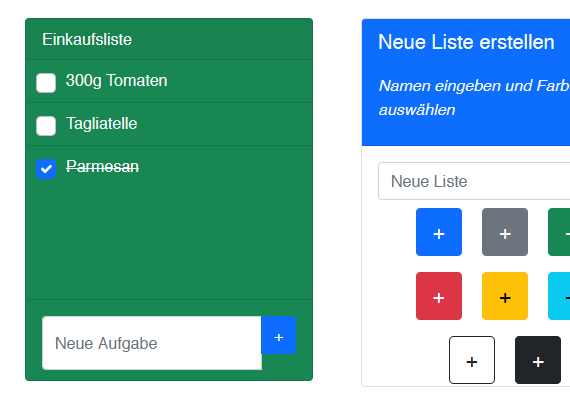

# flask-to-do

Dies ist eine simple Online To-Do Web-App, erstellt mit Python-Flask und App Engine von Google Cloud. 
Verwendet wird Firebase zur Authentifizierung und die Daten werden auf Google Cloud Datastore gespeichert.
Bootstrap 5.0 wird als CSS-Framework verwendet.

Live Beispiel: https://pyflask-app.oa.r.appspot.com/
Zum ausprobieren einfach ein Konto eröffnen mit erfundener E-Mail Adresse, es ist keine Bestätigung nötig, oder mit einem Google Account anmelden.

(Als Vorlage dient diese Beispiel-App von den Google Cloud Tutorials: https://github.com/GoogleCloudPlatform/python-docs-samples/tree/18583e42672f9f69db04f6b02e707333d38a1552/appengine/standard_python3/building-an-app)
